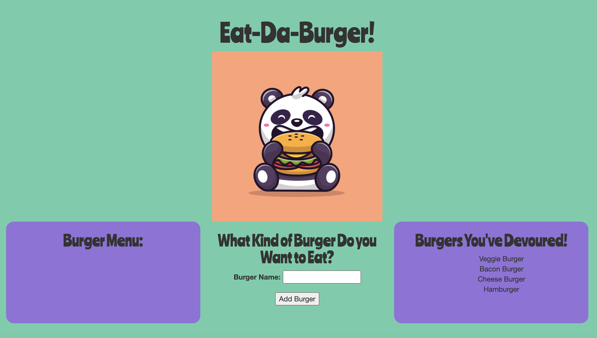

# Eat-Da-Burger

# Description

Eat-Da-Burger is a burger logger created with MySQL, Node, Express, Handlebars and a homemade ORM. It allows the User to log burgers they'd like to eat to the menu and track which one's they've eaten.

# Table of Contents

- [Usage](#usage)
- [Screenshots](#screenshots)
- [License](#license)
- [Questions](#questions)
- [Portfolio](#portfolio)

## Usage

The User adds the name of the burger they want to the Menu by typing it into the input bar and clicking the `Add Burger` button. The burger name they entered will appear in the right-hand column labeled `Menu` with a `Devour it!` button. The User can click on the `Devour It` button when they have eaten the burger and the burger name will then appear in the right-hand column labeled `Burgers You Have Devoured`. The data is stored in local storage whether devoured or not and will re-populate upon page reload.

## Screenshots

## License

- https://choosealicense.com/licenses/mit/

## Questions

If you have any questions, please contact me at jenLkelly@gmail.com.  
 You can also visit my [Github Page](https://github.com/jkelly101).

## Portfolio

If you'd like to see more, please visit my [Portfolio](https://jkelly101.github.io/)!
